# Virtual Reality
## 3D User Interface

**Name:** Prateek Sengar  

[Project Download Link](https://drive.google.com/file/d/11pRtANi568CsP5q6QAIDeEfBVpYP8L7_/view?usp=drive_link) 

[Project Demo Video](https://youtu.be/GfBhAsTzVvw) 

---

In this assignment, I implemented a 3DUI app that lets me explore the campus I build for assignment 1 by using a controller and feed fruits to birds. Additionally, I also have access to two interfaces: one that activates a minimap (World In Miniature - WIM) to indicate their position on campus and another that enables me to view the preferred fruits of each bird. Finally, the WIM must include the ability to teleport. I was able to implement all of these features and some extra features. 

**Unity Version:** 2020.3.25

## Scene Design
As suggested I reused the subsection of the campus I build for assignment 1 (Subsection: P (Heavy Engineering)) with the following additions. 

**Trees:**  I have 10 trees spread across the virtual world (5 types of fruit trees with 2 of each type).

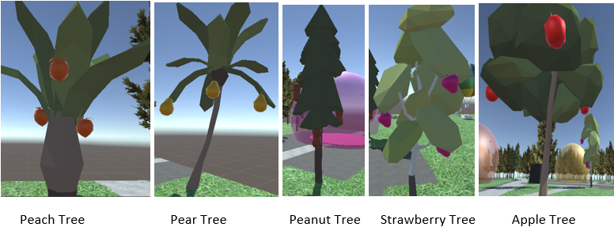

**Fruits:** I have 3 of specific fruits on each tree. Each fruit is picked using Gaze feature and stored in a basket.

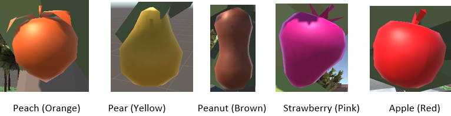

**Hot Air Balloon:** I have a hot air balloon which is used to teleport across the map. I added a few new scripts to the prefab I used for assignment.

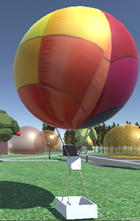

**Birds:** I have 2 of each type of bird (same color as the fruit). Each bird has a fly animation.

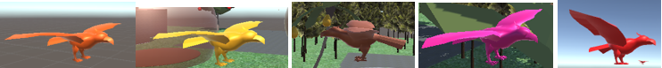

**Feeding Zones:** I have 5 feeding zones (each for each type of bird). The feeding zone has a center circular plate and a transparent bubble around it (same color as the bird that it has). When the user steps on the circular plate and the bird enters the bubble, the fruit is fed to the bird. An example of the red feeding zone is given below.

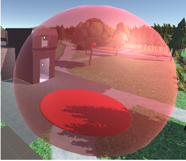

**User Character:** I have a simple looking user but it had a basket to store the collected fruits (from which the fruits can be picked again by using the gaze feature). Also, the user has a hand on which the selected fruit that is to be fed is placed.

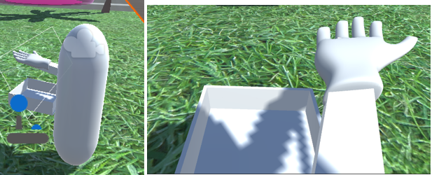

## User Interface
The user interfaces provided to the user (minimap and checklist) can help the user to traverse around efficiently and look at the objectives whenever they please. 

**Minimap:** The minimap is the bird eye view of the player and it captures where the user is (the white marker on the minimap [top right] and the things around the user. The minimap is toggled on or off using the A button on the Xbox controller.

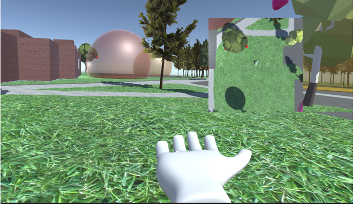

**Checklist:** The checklist has all the fruits required by the user to collect and feed displayed on the top left of the screen by the press of Y button on the Xbox controller. The fruits are color coded for example apple is displayed in red and so on. The bracketed value at the end is the number of fruits fed to the birds. The list is dynamically generated and can be toggled on or off. As the number of fruits fed increases the required fruits to be picked decreases.

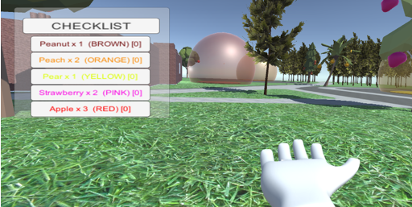

## Navigation
**Walk Mode:** The user can move around using the left stick on the Xbox controller. The user has the freedom to walk around the campus, inside the building, etc along the x and z axis.

**Teleportation:** By using the hot air balloon (get in and out using interaction button X) the user gets the bird eye view of the campus with a black marker that can be placed anywhere the user wishes to travel and after pressing the interaction key once again the user (using the hot air balloon) teleports to that location.

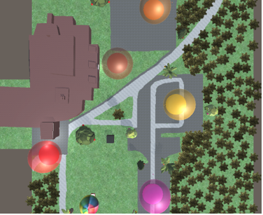

## Button Mapping
This is using the Xbox controller:
- Left Stick: Movement
- X: Interact
- Y: Checklist
- A: Minimap
- B: Third Person View

## Camera View
- **First Person View:** The user can rotate around their first-person view. Also, all the above functionalities are available in first person view.

  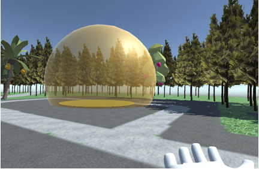

- **Third Person View:** The user can switch to third person view (by using the B button) and can see the character from a third-person perspective.

  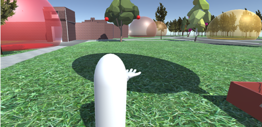

## Scene Interaction
**Fruit Collection:** The fruits are collected by using the Gaze feature. After the user Gazes the fruit it slowly turns green (wait of 5 seconds) and when its green user has to press the interaction key to get the fruit. The fruit is transferred to the basket of the user.

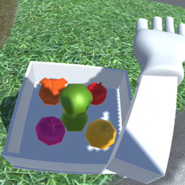

**Bird Feeding:** The user can feed the birds by choosing the correct fruit from the virtual basket and when it turns green pressing X to equip it. When the user stands on the circular platform inside the bubble and the bird is also inside the bubble, the bird eats the fruit and the checklist is updated accordingly.

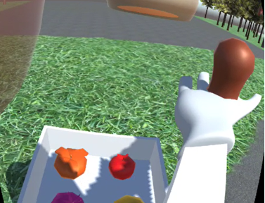

## Extra Credits
1. I implemented the third person view.
2. I implemented the virtual basket feature.
3. I implemented the gaze feeding method.
4. I also implemented a feature to allow the user to go into the building using the main gate and explore inside (colliders on the wall so that the user cannot walk through walls).

## Hierarchy

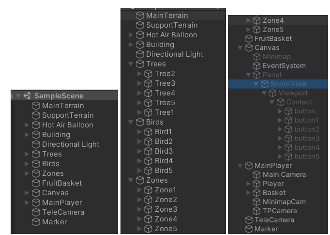

References
1. [Low Poly Tree Pack](https://assetstore.unity.com/packages/3d/vegetation/trees/low-poly-tree-pack-57866)
2. [Low Poly Fruit Pickups](https://assetstore.unity.com/packages/3d/props/food/low-poly-fruit-pickups-98135)
3. [New Input System](https://www.youtube.com/watch?v=HmXU4dZbaMw&ab_channel=BMo), [Input System Video 2](https://www.youtube.com/watch?v=m5WsmlEOFiA&t=907s&ab_channel=samyam)
4. [Teleportation: Code Used](https://www.youtube.com/watch?v=mrYkd1U7RZE&ab_channel=NimaJamalian)
5. [Stylized - Simple Hands](https://assetstore.unity.com/packages/3d/characters/stylized-simple-hands-221297)
6. [Mobile Tree Package](https://assetstore.unity.com/packages/3d/vegetation/trees/mobile-tree-package-18866)
7. [Egypt Pack – Eagle](https://assetstore.unity.com/packages/3d/characters/animals/birds/egypt-pack-eagle-140079)
8. [Toon Furniture](https://assetstore.unity.com/packages/3d/props/furniture/toon-furniture-88740)
9. [Minimap](https://www.youtube.com/watch?v=xh2oQ8t0eqU&ab_channel=GDTitans)
10. Materials and Channel Mixer
11. Google Cardboard XR Plugin for Unity [Sample Scripts]
12. Pro Builder Tool
